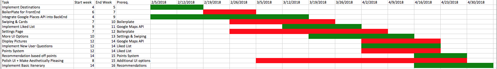

# 4.0 Software Development Plan

## 4.1   Plan Introduction

This Software Development Plan (SDP) provides the details of the planned development for the travel application Destinate.
Destinate is an application that provides event suggestions and itinerary suggestions.

During our 16 week development process, our team will continuously keep in touch with each other via meetings and text message. Prototype versions of our app will be tested and developed on our offline machines until refined enough to have version updates on GitHub.

 In order to develop effectively and challenge ourselves, we will use cutting edge technologies that we were not previously familiar with such as: GO language, Serverless framework, AWS relational database service, AWS Lambda, AWS API Gateway, Ionic Progressive WebApp Framework.

| Function / Feature | Due Date |
|---|---|
|  Implement Destinations | Week 5 |
|  Boilerplate for frontend| Week 7 |
|  Integrate Google places API into backend | Week 8 |
|  Integrate Google places API into backend | Week 9 |
|  Swiping & Cards | Week 10 |
|  Implement Liked List | Week 11 |
|  Settings Page | Week 12|
|  More UI Options | Week 13 |
|  Display Pictures | Week 14|
|  Implement New User Questions | Week 14 |
|  Points system | Week 14 |
|  Recommendation based off points | Week 15 |
|  Polish UI + Make Aesthetically Pleasing | Week 15|
|  Implement Basic Itinerary System | Week 16 |

- 4.1.1 Project Deliverables
  - Alpha (3/28/2018) - The alpha version of Destinate will provide most of the functionality and a rough but useable UI.
  - Beta (4/09/2018) - The beta version of Destinate will begin polishing up the UI and have most of the core functionality fully complete
  - Version 1.0 (4/27/2018) - Version 1.0 will include all features with minimum amount of bugs and a more refined UI.

## 4.2   Project Resources

- 4.2.1 Hardware Resources

| Resource | Development | Execution |
|---|---|---|
| Macbook/Windows Computer | ✓ | ✓ |
| NVIDIA GeForce GT 650M 1024 MB | ✓ | ✓ |
| 16 GB RAM | ✓ | ✓ |
| Internet Connectivity | ✓ | ✓ |
| 768 GB Storage | ✓ | ✓ |

- 4.2.2 Software Resources

|Resource              | Development   | Execution  |
|--------------------- | ------------- | -----------|
|Atom Text Editor      | ✓             |            |
|Ionic                 | ✓             |          |
|Angular.js                 | ✓             |          |
|GO                 | ✓             |          |
|AWS                 | ✓             | ✓         |
|macOS                 | ✓             | ✓         |
|Windows OS            | ✓             | ✓         |
|GitHub                | ✓             |           |

## 4.3   Project Organization

Our team will be working on everything together.

| Name | Team | Role |
|---|---|---|
| Arash Lari | Developer | Create functionalities for Destinate, backend to frontend integration, frontend development, testing |
| Mitchell Simon| Developer  | Create functionalities for Destinate, backend to frontend integration, backend development, testing |

## 4.4   Project Schedule

- 4.4.1 PERT / GANTT Chart

- 4.4.2 Task / Resource Table

| Task | Name | Platform | Technology |
|---|---|---|---|
| Implement Destinations | Mitchell Simon & Arash Lari | Macbook/Windows PC | GO, AWS |
| Boilerplate for frontend | Mitchell Simon & Arash Lari | Macbook/Windows PC | Ionic Framework, Angular.js  |
| Integrate Google places API into backend | Mitchell Simon & Arash Lari | Macbook/Windows PC | GO |
| Swiping & Cards | Mitchell Simon & Arash Lari | Macbook/Windows PC | Ionic Framework, Angular.js |
| Implement Liked List | Mitchell Simon & Arash Lari | Macbook/Windows PC | GO, Ionic Framework, Angular.js |
| Settings Page| Mitchell Simon & Arash Lari | Macbook/Windows PC | Ionic Framework, Angular.js, GO |
| UI Options | Mitchell Simon & Arash Lari | Macbook/Windows PC | Ionic Framework, Angular.js, GO |
| Display Pictures | Mitchell Simon & Arash Lari | Macbook/Windows PC | Ionic Framework, Angular.js, GO |
| Implement New User Questions | Mitchell Simon & Arash Lari | Macbook/Windows PC | Ionic Framework, Angular.js|
| Points system | Mitchell Simon & Arash Lari | Macbook/Windows PC | GO |
| Recommendation based off points | Mitchell Simon & Arash Lari | Macbook/Windows PC | Ionic Framework, Angular.js, GO |
| Implement Basic Itinerary System | Mitchell Simon & Arash Lari | Macbook/Windows PC | Ionic Framework, Angular.js, GO|
